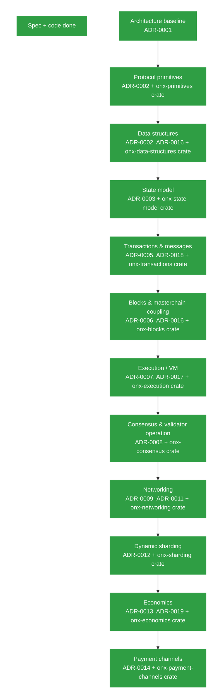

# Open Network X

[](https://github.com/quickerup/The-Open-Network-X/actions/workflows/ci.yml)
[](https://github.com/quickerup/The-Open-Network-X/actions/workflows/codeql.yml)
[](https://github.com/quickerup/The-Open-Network-X/actions/workflows/coverage.yml)
[](https://github.com/quickerup/The-Open-Network-X/actions/workflows/deny.yml)

[](LICENSE)
[](rust-toolchain.toml)
[](https://github.com/quickerup/The-Open-Network-X/commits/main)
[](https://github.com/quickerup/The-Open-Network-X/issues)
[](https://github.com/quickerup/The-Open-Network-X/stargazers)

[](CONTRIBUTING.md)
[](#project-status)

**Open Network X (ONX)** is an independent blockchain implementation project inspired by the architecture and technical vision described in the original The Open Network (TON) white paper.

ONX explores, reconstructs, and implements that vision independently and from first principles. It is not the TON blockchain, is not an official continuation of TON, and is not intended to replace the existing TON network or its community. The native currency of Open Network X is **Onyx**.

## Contents

- [What is Open Network X?](#what-is-open-network-x)
- [Independence](#independence)
- [The white paper is the starting point](#the-white-paper-is-the-starting-point)
- [Onyx](#onyx)
- [Project philosophy](#project-philosophy)
- [Project status](#project-status)
- [Changelog and roadmap](ROADMAP.md)
- [Development tasks](docs/development-tasks.md)
- [Contributing](CONTRIBUTING.md)
- [Repository structure](#repository-structure)
- [Building and testing](#building-and-testing)
- [Long-term goal](#long-term-goal)
- [Disclaimer](#disclaimer)
- [License](#license)

## What is Open Network X?

The original TON design describes a highly scalable, decentralized blockchain architecture built around concepts including:

- Masterchains, workchains, and shardchains
- Dynamic sharding
- Asynchronous message passing
- Validator networks and Byzantine fault-tolerant consensus
- Smart contracts and a specialized virtual machine
- Distributed storage
- Scalable blockchain infrastructure

Open Network X exists to investigate what it would look like to implement that architecture independently. The guiding question is:

> *What would the Open Network look like if we went back to the original design and built an independent implementation from the specification?*

ONX is therefore not intended to be a conventional fork. We are not taking an existing implementation, changing its name, and continuing from there. Instead, the project begins with the protocol's published design and works forward toward an independent implementation.

## Independence

Open Network X is a separate project. ONX:

- Does not claim to be TON.
- Does not claim to represent the TON Foundation, TON Society, or the TON community.
- Does not attempt to replace the existing TON network.
- Does not require the existing TON network to function.
- Does not treat the current TON implementation as the authoritative specification for ONX.
- May make independent technical decisions where the original specification is ambiguous or incomplete.

Similarity between ONX and existing TON architecture is intentional where that similarity follows from the original protocol design.

## The white paper is the starting point

The original TON white paper (`WHITEPAPER.md`) is the primary historical and architectural reference for this project, and is included in this repository as a reference document. ONX does not modify the white paper to make the implementation easier — instead, the implementation adapts to the specification:

- Where the white paper is precise, ONX strives for faithful implementation.
- Where the white paper is ambiguous, ONX documents its interpretation.
- Where the white paper does not provide sufficient information, ONX explicitly identifies the missing information and documents the engineering decision that fills the gap.

## Onyx

Onyx is the native currency of Open Network X. The currency exists as part of the ONX protocol rather than as a separate application-layer token. The exact monetary policy, denomination system, issuance mechanism, validator economics, transaction fees, and other economic parameters will be specified as the protocol develops.

## Project philosophy

ONX follows several principles:

1. **Specification before implementation.** We begin with the protocol design, not with existing source code.
2. **Independent implementation.** Existing implementations may be studied for educational and interoperability research purposes, but ONX is intended to be independently implemented.
3. **Explicit decisions.** When the reference material does not provide an answer, the project records the decision instead of silently inventing behavior.
4. **Testable protocol behavior.** Important protocol properties should eventually have deterministic tests.
5. **No accidental compatibility.** ONX should not inherit compatibility with another network merely because doing so is convenient — compatibility must be an intentional protocol decision.
6. **Transparency.** Architectural deviations, interpretations, limitations, and known incompatibilities should be documented openly.

## Project status

Early research / architecture phase. The initial goal is to establish the protocol specification and engineering principles before attempting to build a production blockchain. Nothing in this repository should currently be interpreted as production-ready blockchain infrastructure.

Specification work completed so far, with accompanying architecture decision records in `docs/decisions/`:

| Layer | Specification | Decision record |
| --- | --- | --- |
| Architecture baseline | `docs/specification/architecture.md` | `ADR-0001` |
| Protocol primitives | `docs/specification/protocol-primitives.md` | `ADR-0002` |
| Data structures | `docs/specification/data-structures.md` | `ADR-0002`, `ADR-0016` |
| State model | `docs/specification/state-model.md` | `ADR-0003` |
| Implementation language | — | `ADR-0004` |
| Transactions and messages | `docs/specification/transactions.md` | `ADR-0005`, `ADR-0018` |
| Blocks and masterchain coupling | `docs/specification/blocks.md` | `ADR-0006`, `ADR-0016` |
| Execution (virtual machine) | `docs/specification/execution.md`, `tvm-instruction-set.md` | `ADR-0007`, `ADR-0017` |
| Consensus and validator operation | `docs/specification/consensus.md` | `ADR-0008` |
| Networking (ADNL, DHT, overlays) | `docs/specification/networking-*.md` | `ADR-0009`–`ADR-0011` |
| Dynamic sharding | `docs/specification/sharding.md` | `ADR-0012` |
| Economics | `docs/specification/economics.md` | `ADR-0013`, `ADR-0019` |
| Payment channels | `docs/specification/payment-channels.md` | `ADR-0014` |

All protocol layers now have their corresponding specification, decision records, and Rust implementations in `crates/`.



See [`ROADMAP.md`](ROADMAP.md) for the full changelog and roadmap of what has been built, and [`CONTRIBUTING.md`](CONTRIBUTING.md) for the workflow every contribution is expected to follow.

## Repository structure

```
.
├── README.md
├── INSTRUCTIONS.md          # Development principles for this repository
├── WHITEPAPER.md            # Reference white paper (unmodified)
├── Cargo.toml               # Rust workspace
├── crates/
│   ├── onx-primitives/      # Canonical encoding, hashing, and signatures
│   ├── onx-data-structures/ # ShardIdent, account/workchain IDs, messages, block headers
│   ├── onx-state-model/     # Account states, Cell/BoC serialization, Merkle proofs
│   ├── onx-transactions/    # Message admission, output-queue delivery, double-delivery prevention
│   ├── onx-blocks/          # Block structural validity, masterchain coupling, split/merge flags
│   ├── onx-execution/       # TVM execution engine, 46-opcode interpreter, gas metering
│   ├── onx-payment-channels/# Payment channel arbiter, dispute resolution, off-chain state
│   ├── onx-consensus/       # Validator election, 2/3 BFT quorum voting, finality evaluation
│   ├── onx-networking/      # ADNL identity, RLDP datagram transport, DHT records, overlays
│   ├── onx-sharding/        # Shard tree invariants, split/merge trigger logic, state migration
│   └── onx-economics/       # Storage fee accrual, fee burn split, epoch inflation reward
└── docs/
    ├── specification/       # ONX protocol specifications
    └── decisions/           # Architecture decision records (ADRs)
```

## Building and testing

ONX is implemented in Rust. With a recent stable toolchain installed:

```sh
cargo build --workspace --all-targets
cargo test --workspace --all-targets
```

## Long-term goal

The long-term goal is to develop an independent, functioning blockchain network that faithfully implements the core architecture described by the original TON design while maintaining a distinct identity, implementation, network, and ecosystem. ONX should ultimately be able to stand on its own — the project does not need to replace TON to be successful, only to demonstrate what an independent implementation of the underlying architectural vision can become.

## Disclaimer

Open Network X is an independent project. ONX, Open Network X, and Onyx should not be represented as official TON products, networks, or services. The use of historical TON technical material as a reference does not imply endorsement, affiliation, or control by the organizations or communities associated with the existing TON ecosystem.

## License

Open Network X is licensed under the [Apache License, Version 2.0](LICENSE), as decided in [ADR-0015](docs/decisions/ADR-0015-project-license.md). Individual reference materials may have their own copyright and licensing requirements — see `WHITEPAPER.md` for the applicable source and attribution information.
